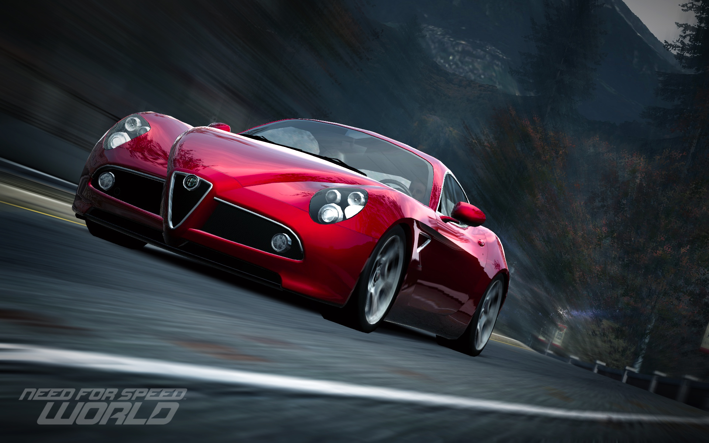
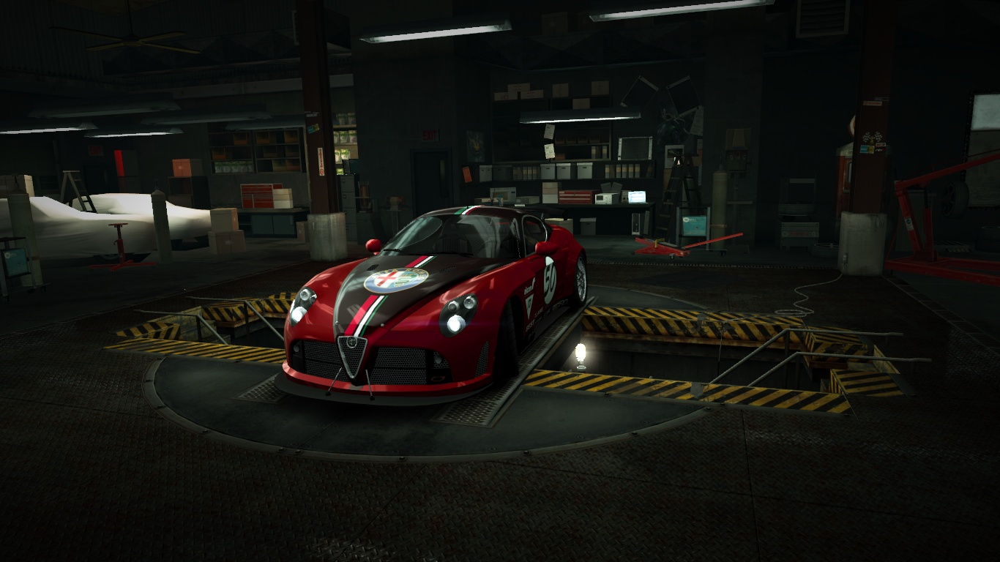
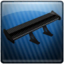

# Romeo 8C Competizione

The car has a stock top speed of 308 km/h \(191 mph\) for Class A. Its acceleration is strong but lacks power when compared to other cars in its class. The car has also an average nitrous output. The handling of the car is good and very responsive. However, the 8C can spin out easily.

| Achievable Classes |
| :---: |

| Stock |  Max |
| :---: | :---: |
|   |   |

| A-Spec |
| :---: |

### Aftermarket Parts

| Verge wide | Glint | Glint | Style B 19" | Stock | Black | Stage 3 | 8C-BIC |
| :--- | :---: | :---: | :---: | :---: | :---: | :---: | :---: |
|  |  |  |  |  |  |  |  |

### Skillmods

|  |  |  |  |  |
| :---: | :---: | :---: | :---: | :---: |
|  |  |  |  |  |

