# Engines

## Getting Super Powers


**Yellow Performance Parts**


These engines are all about delivering the middle of the road power output. Think of this as a Ram Air Intake upgrade, which increases engine power in the lower-mid range. It's usually muscle cars such as a Dodge Viper SRT10 or its full-size relative, the Dodge Charger SRT8, that benefit from this engine, but it will also work for exotic cars like the Ford GT and the SLR McLaren.

| Amerikon SpeedSystems | Gromlen |
| :---: | :---: |
| 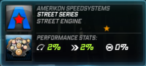 | 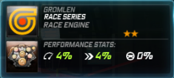 |

| Medion | Transtek |
| :---: | :---: |
| 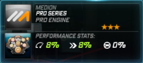 |  |

| Quartz Speed Packages |
| :---: |
|  |


**Blue Performance Parts**


These engines are high-torque powerplant designed to pack quite a punch, allowing for quicker acceleration. What this would be suitable for is a low-RPM car, i.e. many of the classic muscle cars in the game \(Chevelle SS especially\), or in a real-life application, a high-torque AMG Mercedes.

| Dawndraft | Kestrel |
| :---: | :---: |
| 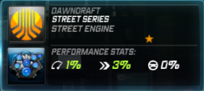 | 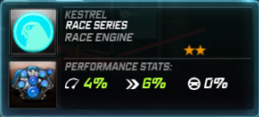 |

| Velocicom | Zero Tuning Mods |
| :---: | :---: |
| 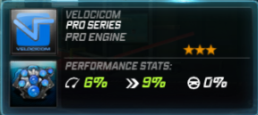 | 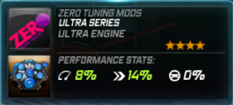 |

| Stick Motorsport |
| :---: |
| 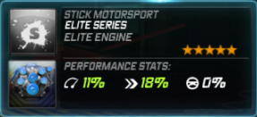 |


**Red Performance Parts**


These engines are considered to be the worst brand for power parts according to the NFSW community, is the lighter version of AmerikonSS/Gromlen/Medion. The difference between the two is that this is NOT designed for V10 engines; rather they're more Inline oriented \(Supra, Lancer Evolution and others of this nature\). This is a must for every turbocharged engine, as too much horsepower will kill the car's torque, and too much torque will hold it back from its true potential.

| Nova-T | Richter |
| :---: | :---: |
| 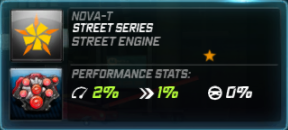 | 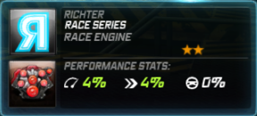 |

| Ventura | Attack Motorsport |
| :---: | :---: |
| 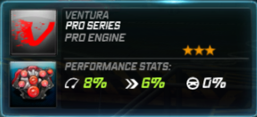 | 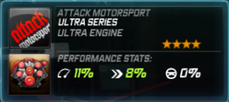 |

| Tear |
| :---: |
| 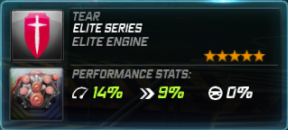 |


**Green Performance Parts**


These engines are tuned to provide high end hp with pretty bad low end torque, requiring an induction 9 times out of 10 to help out. Do note that this should be used only on cars with the peak near the high range \(Nissan Skyline GT-R\), rather than cars that still have quite a ways to go between their peak power and redline \(Mazda RX-7\).

| Omnia Racegruppe | Norset |
| :---: | :---: |
|  | 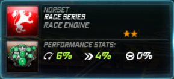 |

| URSA Motorsport | SpeedSciens |
| :---: | :---: |
| 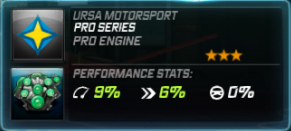 | 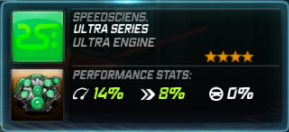 |

| Dynamo Aftermarket Kits |
| :---: |
| 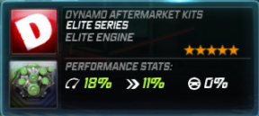 |

