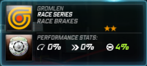

# Brakes

## Getting Super Powers


**Yellow Performance Parts**


A set of front and rear brakes tuned for a slight front bias. If no car you own seems to fit the Ventura brakes, you can go for these.

| Amerikon SpeedSystems | Gromlen |
| :---: | :---: |
|  |  |

| Medion | Transtek |
| :---: | :---: |
|  |  |

| Quartz Speed Packages |
| :---: |
|  |


**Blue Performance Parts**


A set of unbiased front and rear brakes with the purpose of quicker deceleration. These brakes do increase the risk of understeer due to the fact that they are very powerful and will lock your tires up, requiring earlier braking.
| Dawndraft | Kestrel |
| :---: | :---: |
|  |  |

| Velocicom | Zero Tuning Mods |
| :---: | :---: |
|  |  |

| Stick Motorsport |
| :---: |
|  |


**Red Performance Parts**


A set of front and rear brakes tuned to have the rear lock up slightly before the front. Causes braking oversteer and makes the car's rear more likely to slide. Best used on rear-wheel-drive cars with drift tunings as well as known track cars like the Elise.

| Nova-T | Richter |
| :---: | :---: |
|  |  |

| Ventura | Attack Motorsport |
| :---: | :---: |
|  |  |

| Tear |
| :---: |
|  |


**Green Performance Parts**


A set of unbiased front and rear brakes tuned kinda loosely. This was done to provide stable braking at high speeds(avoid locking up). The downfall is that the brakes have to be applied a bit earlier coming into a turn. These brakes should be paired up with Medion tires as the grip should slow you down.

| Omnia Racegruppe | Norset |
| :---: | :---: |
|  |  |

| URSA Motorsport | SpeedSciens |
| :---: | :---: |
|  |  |

| Dynamo Aftermarket Kits |
| :---: |
|  |

