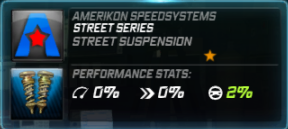
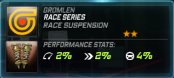
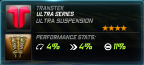
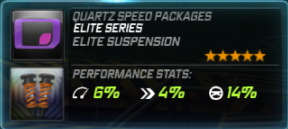
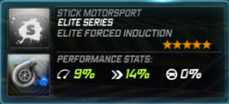
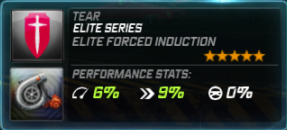
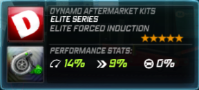

# Suspensions

## Getting Super Powers


**Yellow Performance Parts**


This suspension is set to a soft setting. The resulting behavior is better traction and stability off road and on highways but understeer in turns and cause the car to jump higher on any smooth hills. The car will feel more stable going over tiny bumps such as apex's and sidewalks and will loose less speed from collisions. Cars that would benefit from this suspension are muscle cars, which, in World, are well known for having either no stability, no traction, or having neither.

| Amerikon SpeedSystems | Gromlen |
| :---: | :---: |
|  |  |

| Medion | Transtek |
| :---: | :---: |
|  |  |

| Quartz Speed Packages |
| :---: |
|  |


**Blue Performance Parts**


This is more or less the inverse of the Gold, tuned for better response at low-RPM. What this means is that it has smaller components and as a result is capable of making more power quicker than the Golf. The drawback with this induction, however, is that you get less power up top. This is suitable for torquier engines, namely those of classic muscle cars.

| Dawndraft | Kestrel |
| :---: | :---: |
|  |  |

| Velocicom | Zero Tuning Mods |
| :---: | :---: |
|  |  |

| Stick Motorsport |
| :---: |
|  |


**Red Performance Parts**


These are not made to be strong. It is a turbo system that actually spools quickly up to speed, compromising top end boost in the process. This turbo is optional to install, but if you were to install one, it is best applicalbe to high-RPM cars, the Murcielago LP640 and the Porsche 911 GT3 RS being prime examples.

| Nova-T | Richter |
| :---: | :---: |
|  |  |

| Ventura | Attack Motorsport |
| :---: | :---: |
|  |  |

| Tear |
| :---: |
|  |


**Green Performance Parts**


Screaming like a banshee, the Green turbo delivers sheer power at high-RPM and is thus the perfect brand for many turbocharged and/or naturally-aspirated cars like the RX-7 or the Corvette Z06 \(yes, the Z06 carries a turbo, not a supercharger\). It takes much longer to spool up than the Red, but it does deliver more boost once it reaches the top. Usually, the more peaky the engine, the more Boost it would need, but DO NOT apply this to a Green Engine as the car would die off in the lower range.

| Omnia Racegruppe | Norset |
| :---: | :---: |
|  |  |

| URSA Motorsport | SpeedSciens |
| :---: | :---: |
|  |  |

| Dynamo Aftermarket Kits |
| :---: |
|  |

