# Suspensions

## Getting Super Powers


**Yellow Performance Parts**


This suspension is set to a soft setting. The resulting behavior is better traction and stability off road and on highways but understeer in turns and cause the car to jump higher on any smooth hills. The car will feel more stable going over tiny bumps such as apex's and sidewalks and will loose less speed from collisions. Cars that would benefit from this suspension are muscle cars, which, in World, are well known for having either no stability, no traction, or having neither.

| Amerikon SpeedSystems | Gromlen |
| :---: | :---: |
|  |  |

| Medion | Transtek |
| :---: | :---: |
|  |  |

| Quartz Speed Packages |
| :---: |
|  |


**Blue Performance Parts**


Designed for drag and rally cars, this suspension semi-stiffens the car, reducing body roll and helping the car accelerate, but in turn causing turning oversteer from. Cars that would benefit from this are front-heavy all-wheel-drive cars which are known to, according to the physics of World, have a lot of understeer and at times even have trouble accelerating.

| Dawndraft | Kestrel |
| :---: | :---: |
| 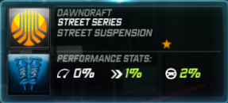 | 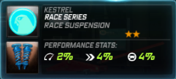 |

| Velocicom | Zero Tuning Mods |
| :---: | :---: |
| 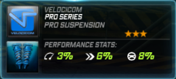 | 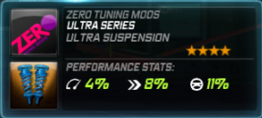 |

| Stick Motorsport |
| :---: |
| 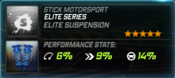 |


**Red Performance Parts**


Possibly the best suspension in the bracket, this stiffens up the car, thereby provoking more oversteer and delivering a crisper turn-in. Works well with many cars, whether they be drifters or have a hard time cornering. Note: This should be used only with rear-wheel drive as all-wheel drive cars don't respond well to this as they would the blue suspension.

| Nova-T | Richter |
| :---: | :---: |
| 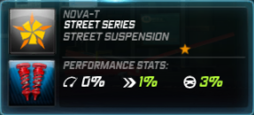 | 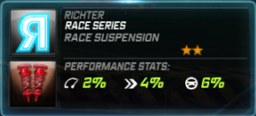 |

| Ventura | Attack Motorsport |
| :---: | :---: |
| 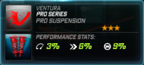 | 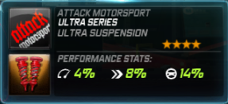 |

| Tear |
| :---: |
| 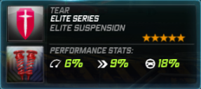 |


**Green Performance Parts**


As with the Yellow suspension, the Green suspension has a semi-soft tuned setup, though in contrast, it provides a great deal of stability as the car gains speed and is therefore an exceptional choice for a highway-tuned car. However, as Omnia/Norset/URSA fails in the handling department, be prepared to face major understeer.

| Omnia Racegruppe | Norset |
| :---: | :---: |
| 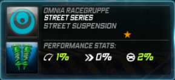 | 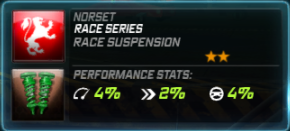 |

| URSA Motorsport | SpeedSciens |
| :---: | :---: |
| 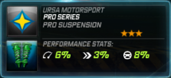 | 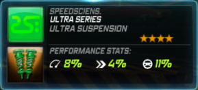 |

| Dynamo Aftermarket Kits |
| :---: |
| 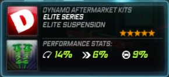 |

