# Tires

## Getting Super Powers


**Yellow Performance Parts**


These tires improve the handling of a car all across the board by boosting grip by a considerable margin. By doing this, your car gets improved traction and improved stability and is recommended for any car that lacks in both fields. You do get some mild understeer, but it doesn't make much of a difference to be considered car-breaking.

| Amerikon SpeedSystems | Gromlen |
| :---: | :---: |
| 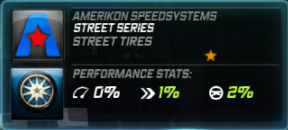 | 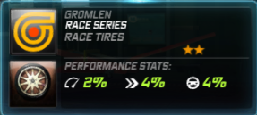 |

| Medion | Transtek |
| :---: | :---: |
|  | 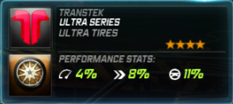 |

| Quartz Speed Packages |
| :---: |
| 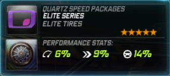 |


**Blue Performance Parts**


These are a set of tires that boost acceleration considerably by increasing traction. Their tendency to cause moderate oversteer, however, should be noted \(although at times, if you know how, you can force power oversteer\). ~ Credit to legor17 for the insight on power oversteer. Anecdotal information.

| Dawndraft | Kestrel |
| :---: | :---: |
| 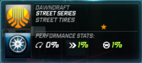 | 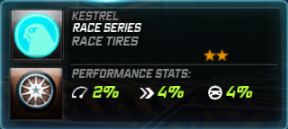 |

| Velocicom | Zero Tuning Mods |
| :---: | :---: |
| 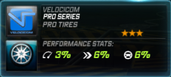 | 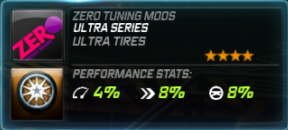 |

| Stick Motorsport |
| :---: |
| 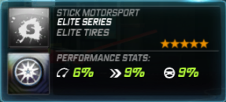 |


**Red Performance Parts**


Designed for drifting, Nova-T/Richter/Ventura tires are perfect for known driftable cars \(i.e. RX-7, 240SX, 350Z, 370Z, Silvia S15, AE116, etc.\) as they help the car slide out in turns, basically the same function brakes with a rear bias have. These are also useful for track cars; however, as with the suspension of the same brand, this should be left to rear-wheel-drive vehicles.

| Nova-T | Richter |
| :---: | :---: |
| 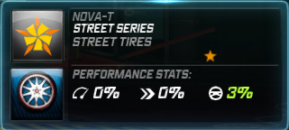 | 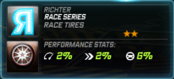 |

| Ventura | Attack Motorsport |
| :---: | :---: |
| 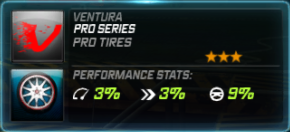 | 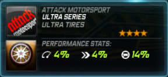 |

| Tear |
| :---: |
| 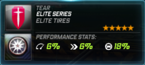 |


**Green Performance Parts**


These are a set of tires that benefit cars that rule on the highways. While the stat increases don't tell you, they increase stability at high speeds, so in a way, these tires improve top speed. As with the blue tires, however, this causes turning understeer and, as a result, require precision turning from the driver.

| Omnia Racegruppe | Norset |
| :---: | :---: |
| 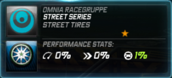 | 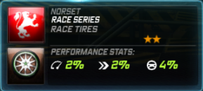 |

| URSA Motorsport | SpeedSciens |
| :---: | :---: |
| 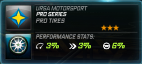 | 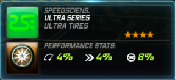 |

| Dynamo Aftermarket Kits |
| :---: |
| 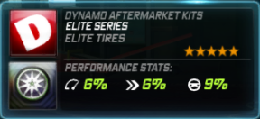 |

