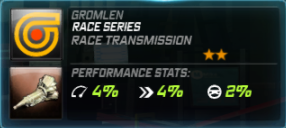
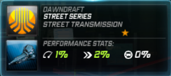

# Transmissions

## Getting Super Powers


**Yellow Performance Parts**


Somewhere in your life you've heard and/or read about a big blower in a muscle car. Such is the case here, as the Gold Induction delivers raw power widespread across the RPM ranges in engines that are more HP-oreinted \(Exige Cup 260, Shelby GT500 SS to name a few\). It improves both acceleration and top speed, although it has a bit of a bias toward the horsepower side of things. It takes a while to make power, but the boost is massive once it does.

| Amerikon SpeedSystems | Gromlen |
| :---: | :---: |
|  |  |

| Medion | Transtek |
| :---: | :---: |
|  |  |

| Quartz Speed Packages |
| :---: |
|  |


**Blue Performance Parts**


This is more or less the inverse of the Gold, tuned for better response at low-RPM. What this means is that it has smaller components and as a result is capable of making more power quicker than the Golf. The drawback with this Transmission, however, is that you get less power up top. This is suitable for torquier engines, namely those of classic muscle cars.

| Dawndraft | Kestrel |
| :---: | :---: |
|  |  |

| Velocicom | Zero Tuning Mods |
| :---: | :---: |
|  |  |

| Stick Motorsport |
| :---: |
|  |


**Red Performance Parts**


These are not made to be strong. It is a turbo system that actually spools quickly up to speed, compromising top end boost in the process. This turbo is optional to install, but if you were to install one, it is best applicalbe to high-RPM cars, the Murcielago LP640 and the Porsche 911 GT3 RS being prime examples.

| Nova-T | Richter |
| :---: | :---: |
|  |  |

| Ventura | Attack Motorsport |
| :---: | :---: |
|  |  |

| Tear |
| :---: |
|  |


**Green Performance Parts**


Screaming like a banshee, the Green turbo delivers sheer power at high-RPM and is thus the perfect brand for many turbocharged and/or naturally-aspirated cars like the RX-7 or the Corvette Z06 \(yes, the Z06 carries a turbo, not a supercharger\). It takes much longer to spool up than the Red, but it does deliver more boost once it reaches the top. Usually, the more peaky the engine, the more Boost it would need, but DO NOT apply this to a Green Engine as the car would die off in the lower range.

| Omnia Racegruppe | Norset |
| :---: | :---: |
|  |  |

| URSA Motorsport | SpeedSciens |
| :---: | :---: |
|  |  |

| Dynamo Aftermarket Kits |
| :---: |
|  |

