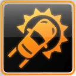

# Home

**Pursuit Powerups**

| Emergency Evade | **Information** |
| :---: | :---: |
|  | Emergency Evade is a powerup which will knock back any AI vehicle covered within a certain radius of the car. The powerup can be used in both Pursuit Outrun and individually in Team Escape. |

| Instant Cooldown | **Information** |
| :---: | :---: |
|  | Instant Cooldown is a Powerup that can only be activated when a player enters Cooldown Mode in a Pursuit Outrun. When activated, the Instant Cooldown powerup will then instantly fill the cooldown meter and end the pursuit. |

| Juggernaut | **Information** |
| :---: | :---: |
|  | Juggernaut is one of the few powerups that can be activated in all modes. Juggernaut will give the player extra ramming power, acceleration and a heavier weight for the player's vehicle. The increased weight, however, worsens the handling of the vehicle. |

| Run Flats | **Information** |
| :---: | :---: |
|  | Run Flats (also called Run Flat Tires) are a powerup that is used to re-inflate tires during a Pursuit Outrun or Team Escape. This powerup can be activated after running over a Spikestrip. |