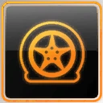

# Home

## **Pursuit Powerups**

| Emergency Evade | **Information** |
| :---: | :---: |
|  | Emergency Evade is a powerup which will knock back any AI vehicle covered within a certain radius of the car. The powerup can be used in both Pursuit Outrun and individually in Team Escape. |

| Instant Cooldown | **Information** |
| :---: | :---: |
|  | Instant Cooldown is a Powerup that can only be activated when a player enters Cooldown Mode in a Pursuit Outrun. When activated, the Instant Cooldown powerup will then instantly fill the cool down meter and end the pursuit. |

| Juggernaut | **Information** |
| :---: | :---: |
|  | Juggernaut is one of the few powerups that can be activated in all modes. Juggernaut will give the player extra ramming power, acceleration and a heavier weight for the player's vehicle. The increased weight, however, worsens the handling of the vehicle. |

| Run Flats | **Information** |
| :---: | :---: |
|  | Run Flats \(also called Run Flat Tires\) are a powerup that is used to re-inflate tires during a Pursuit Outrun or Team Escape. This powerup can be activated after running over a Spikestrip. |

## **Team Escape Powerups**

| Team Emergency Evade | **Information** |
| :---: | :---: |
|  | Team Emergency Evade is Team Escape powerup that knocks cops back if they're too close to your car. It works the same as the standard Emergency Evade, but this affects all teammates, not just you, so it can be used if another teammate is in trouble. |

| Team Slingshot | **Information** |
| :---: | :---: |
|  | Team Slingshot is a power-up that may be very useful in a Team Escape by giving the entire team a boost in speed similar to the individual Slingshot. This can help the players falling behind to catch up, but should be used with caution, as it can also catch a team-mate off guard causing them to crash or get stuck. |

## **Race Powerups**

| One More Lap | **Information** |
| :---: | :---: |
|  | One More Lap is a powerup that adds another lap on Circuit races. The powerup can be useful when catching-up to other players, however, if a player is too far behind the race leaders in a long circuit track, there is a chance that the player won't finish and then be disqualified from the race. The powerup can only be used one time per race. |

| Nitrous | **Information** |
| :---: | :---: |
|  | Nitrous \(Also known as NOS\) is a powerup which will give the player a quick burst of speed to the player's vehicle. The effect of the Nitrous powerup differs from car to car. |

| Ready | **Information** |
| :---: | :---: |
|  | Ready is a powerup that will give players access to powerups whenever they are needed. The Ready powerup will eliminate the cool down period for powerups which will make them available for usage again. However, the Ready powerup itself has to be recharged in order to prevent players from reactivating Ready over and over again. |

| Shield | **Information** |
| :---: | :---: |
|  | Shield is a powerup which will prevent players from being affected from the Traffic Magnet-powerup. Shields also has the ability of blocking Traffic Magnets whenever a player activates one meaning that the player won't be affected by a Traffic Magnet whenever a Shield is activated. |

| Slingshot | **Information** |
| :---: | :---: |
|  | Slingshot is a powerup which will increase the performance of the player's car in events. The Slingshot powerup can be activated if the player is in second place or below. The effect of the Slingshot mod is also dependent on what place the player is in a race. The lower place a player is in, the greater the boost from the Slingshot will be. |

| Traffic Magnet | **Information** |
| :---: | :---: |
|  | Traffic Magnet is a powerup used to slow down the leading player in a race. When a Traffic Magnet is activated, traffic cars will attempt to collide with the race leader. If the race leader crashes into a traffic car the race leader will lose time, allowing the other players behind to catch up. |

| Ghost | **Information** |
| :---: | :---: |
|  | Ghost is a powerup which will give the player temporary immunity to collisions. The effect of Ghost is effectively a Juggernaut alternative against rammers in-game. |

