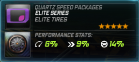

# Home

**Pursuit Powerups**

| Emergency Evade | **Information** |
| :---: | :---: |
|  | Emergency Evade is a powerup which will knock back any AI vehicle covered within a certain radius of the car. The powerup can be used in both Pursuit Outrun and individually in Team Escape. The effect of Emergency Evade can be upgraded via three different Skill Mods |

| Amerikon SpeedSystems | Gromlen |
| :---: | :---: |
|  |  |

| Medion | Transtek |
| :---: | :---: |
|  |  |

| Quartz Speed Packages |
| :---: |
|  |

